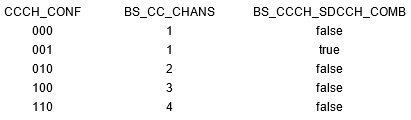
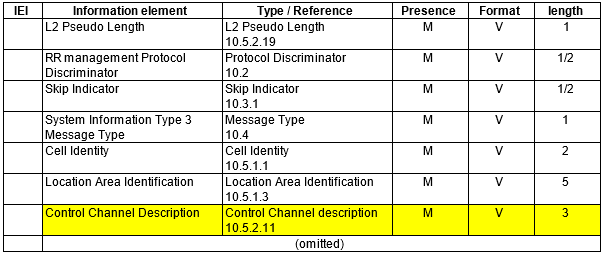
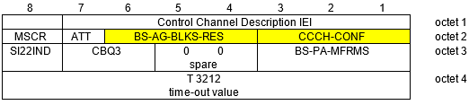
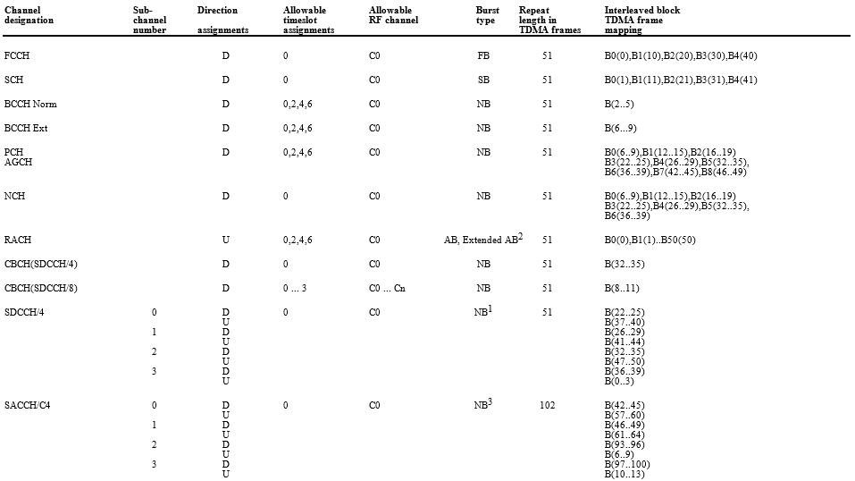
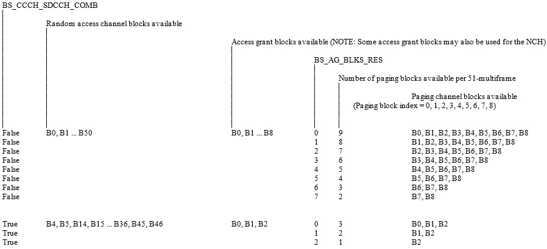

type:: article
tags:: #GSM
public:: true

- # Control channel allocation determination parameter
	- In GSM, control channel allocation is basically determined by two parameters: `CCCH_CONF` and `BS_AG_BLKS_RES`.
	- `BS_CC_CHANS` and `BS_CCCH_SDCCH_COMB` are derived from `CCCH_CONF`:
	   
	  from 3GPP TS 45.002 clause 3.3.2.3 Broadcast control channel (BCCH).
	- `BS_CC_CHANS` defines the number of control channels. By default timeslot 0 is used and as the value increases, timeslot 2, 4, and 6 are used, respectively. And `BS_CCCH_SDCCH_COMB` defines whether the control channels are combined with SDCCH and SACCH:
	- > iii) The parameter BS_CC_CHANS in the BCCH defines the number of basic physical channels supporting common control channels (CCCHs). All shall use timeslots on radio frequency channel C0 of the cell allocation. The first CCCH shall use timeslot number 0, the second timeslot number 2, the third timeslot number 4 and the fourth timeslot number 6. Each CCCH carries its own CCCH_GROUP of mobiles in idle mode. Mobiles in a specific CCCH_GROUP will listen for paging messages and make random accesses only on the specific CCCH to which the CCCH_GROUP belongs. The method by which a mobile determines the CCCH_GROUP to which it belongs is defined in subclause 6.5.2.
	  iv) The parameter BS_CCCH_SDCCH_COMB in the BCCH (see subclause 3.3.2) defines whether the common control channels defined are combined with SDCCH/4(0.3) + SACCH/C4(0.3) onto the same basic physical channel. If they are combined then the number of available random access channel blocks (access grant channel blocks and paging channel blocks; see following), are reduced as defined in table 5 of clause 7.
	  from 3GPP TS 45.002 clause 6.5.1 General, Operation of channels and channel combinations
	- These parameters are broadcast via _Control channel description IE_ in System information type 3:
	  
	  
	  from 3GPP TS 44.018 clause 9.1.35 System information type 3 and clause 10.5.2.11 Control Channel Description.
	- In the following, how these parameters are used will be explained.
- # Channel combinations
	- Given multiple types of control channels, only specific combinations of channels are permitted:
	  > (omitted)
	  iv) FCCH + SCH + BCCH + CCCH
	  v) FCCH + SCH + BCCH + CCCH + SDCCH/4(0..3) + SACCH/C4(0..3)
	  vi) BCCH + CCCH
	  (omitted)
	  from 3GPP TS 45.002 clause 6.4.1 Permitted channel combinations onto a basic physical channel
- # Mapping logical channels to physical channels
	- Given the channel combinations, each control channel can be mapped onto specific physical channels, i.e. specific frequency, downlink/uplink and timeslot:
	  {:height 337, :width 585}
	  from 3GPP TS 45.002 clause 7 Mapping tables.
		- C0 means radio frequency channel where BCCH is transmitted.
	- In addition, `BS_CCCH_SDCCH_COMB` and `BS_AG_BLKS_RES` determine the number of RACH, AGCH and PCH blocks:
	  
	  from 3GPP TS 45.002 clause 7 Mapping tables.
- # Control channel allocation
	- Putting all abovementioned specification together, we have followings:
		- Channel combination iv:
		  ```txt
		  FN   0  1  2  3  4  5  6  7  8  9 10 11 12 13 14 15 16 17 18 19 20 21 22 23 24 25 26 27 28 29 30 31 32 33 34 35 36 37 38 39 40 41 42 43 44 45 46 47 48 49 50
		     +--+--+--+--+--+--+--+--+--+--+--+--+--+--+--+--+--+--+--+--+--+--+--+--+--+--+--+--+--+--+--+--+--+--+--+--+--+--+--+--+--+--+--+--+--+--+--+--+--+--+--+
		  DL | F| S| B  B  B  B| C  C  C  C| F| S| C  C  C  C| C  C  C  C| F| S| C  C  C  C| C  C  C  C| F| S| C  C  C  C| C  C  C  C| F| S|PA PA PA PA|PA PA PA PA| I|
		     +--+--+--+--+--+--+--+--+--+--+--+--+--+--+--+--+--+--+--+--+--+--+--+--+--+--+--+--+--+--+--+--+--+--+--+--+--+--+--+--+--+--+--+--+--+--+--+--+--+--+--+
		  UL | R| R| R| R| R| R| R| R| R| R| R| R| R| R| R| R| R| R| R| R| R| R| R| R| R| R| R| R| R| R| R| R| R| R| R| R| R| R| R| R| R| R| R| R| R| R| R| R| R| R| R|
		     +--+--+--+--+--+--+--+--+--+--+--+--+--+--+--+--+--+--+--+--+--+--+--+--+--+--+--+--+--+--+--+--+--+--+--+--+--+--+--+--+--+--+--+--+--+--+--+--+--+--+--+
		  
		  F: FCCH, S: SCH, B: BCCH, C: CCCH, PA: PCH or AGCH, I: Idle, R: RACH
		  ```
		- Channel combination v:
		  ```txt
		  FN   0  1  2  3  4  5  6  7  8  9 10 11 12 13 14 15 16 17 18 19 20 21 22 23 24 25 26 27 28 29 30 31 32 33 34 35 36 37 38 39 40 41 42 43 44 45 46 47 48 49 50
		     +--+--+--+--+--+--+--+--+--+--+--+--+--+--+--+--+--+--+--+--+--+--+--+--+--+--+--+--+--+--+--+--+--+--+--+--+--+--+--+--+--+--+--+--+--+--+--+--+--+--+--+
		  DL | F| S| B  B  B  B| C  C  C  C| F| S| C  C  C  C| C  C  C  C| F| S|D0 D0 D0 D0|D1 D1 D1 D1| F| S|D2 D2 D2 D2|D3 D3 D3 D3| F| S|A0 A0 A0 A0|A1 A1 A1 A1| I|
		     +--+--+--+--+--+--+--+--+--+--+--+--+--+--+--+--+--+--+--+--+--+--+--+--+--+--+--+--+--+--+--+--+--+--+--+--+--+--+--+--+--+--+--+--+--+--+--+--+--+--+--+
		  UL |D3 D3 D3 D3| R| R|A2 A2 A2 A2|A3 A3 A3 A3| R| R| R| R| R| R| R| R| R| R| R| R| R| R| R| R| R| R| R| R| R| R| R|D0 D0 D0 D0|D1 D1 D1 D1| R| R|D2 D2 D2 D2|
		     +--+--+--+--+--+--+--+--+--+--+--+--+--+--+--+--+--+--+--+--+--+--+--+--+--+--+--+--+--+--+--+--+--+--+--+--+--+--+--+--+--+--+--+--+--+--+--+--+--+--+--+
		     
		  FN  51 52 53 54 55 56 57 58 59 60 61 62 63 64 65 66 67 68 69 70 71 72 73 74 75 76 77 78 79 80 81 82 83 84 85 86 87 88 89 90 91 92 93 94 95 96 97 98 99 00 01
		     +--+--+--+--+--+--+--+--+--+--+--+--+--+--+--+--+--+--+--+--+--+--+--+--+--+--+--+--+--+--+--+--+--+--+--+--+--+--+--+--+--+--+--+--+--+--+--+--+--+--+--+
		  DL | F| S| B  B  B  B| C  C  C  C| F| S| C  C  C  C| C  C  C  C| F| S|D0 D0 D0 D0|D1 D1 D1 D1| F| S|D2 D2 D2 D2|D3 D3 D3 D3| F| S|A2 A2 A2 A2|A3 A3 A3 A3| I|
		     +--+--+--+--+--+--+--+--+--+--+--+--+--+--+--+--+--+--+--+--+--+--+--+--+--+--+--+--+--+--+--+--+--+--+--+--+--+--+--+--+--+--+--+--+--+--+--+--+--+--+--+
		  UL |D3 D3 D3 D3| R| R|A2 A2 A2 A2|A3 A3 A3 A3| R| R| R| R| R| R| R| R| R| R| R| R| R| R| R| R| R| R| R| R| R| R| R|D0 D0 D0 D0|D1 D1 D1 D1| R| R|D2 D2 D2 D2|
		     +--+--+--+--+--+--+--+--+--+--+--+--+--+--+--+--+--+--+--+--+--+--+--+--+--+--+--+--+--+--+--+--+--+--+--+--+--+--+--+--+--+--+--+--+--+--+--+--+--+--+--+
		  
		  F: FCCH, S: SCH, B: BCCH, C: CCCH, Dn: SDCCH/4(n), An: SACCH/C4(n), I: Idle
		  ```
		- Channel combintaion vi:
		  ```txt
		  FN   0  1  2  3  4  5  6  7  8  9 10 11 12 13 14 15 16 17 18 19 20 21 22 23 24 25 26 27 28 29 30 31 32 33 34 35 36 37 38 39 40 41 42 43 44 45 46 47 48 49 50
		     +--+--+--+--+--+--+--+--+--+--+--+--+--+--+--+--+--+--+--+--+--+--+--+--+--+--+--+--+--+--+--+--+--+--+--+--+--+--+--+--+--+--+--+--+--+--+--+--+--+--+--+
		  DL | I| I| B  B  B  B|PA PA PA PA| I| I|PA PA PA PA|PA PA PA PA| I| I|PA PA PA PA|PA PA PA PA| I| I|PA PA PA PA|PA PA PA PA| I| I|PA PA PA PA|PA PA PA PA| I|
		     +--+--+--+--+--+--+--+--+--+--+--+--+--+--+--+--+--+--+--+--+--+--+--+--+--+--+--+--+--+--+--+--+--+--+--+--+--+--+--+--+--+--+--+--+--+--+--+--+--+--+--+
		  UL | R| R| R| R| R| R| R| R| R| R| R| R| R| R| R| R| R| R| R| R| R| R| R| R| R| R| R| R| R| R| R| R| R| R| R| R| R| R| R| R| R| R| R| R| R| R| R| R| R| R| R|
		     +--+--+--+--+--+--+--+--+--+--+--+--+--+--+--+--+--+--+--+--+--+--+--+--+--+--+--+--+--+--+--+--+--+--+--+--+--+--+--+--+--+--+--+--+--+--+--+--+--+--+--+
		  
		  B: BCCH, C: CCCH, PA: PCH or AGCH, I: Idle, R: RACH
		  ```
		- Channel allocation:
		  | `CCCH_CONF` | `BS_CC_CHANS` | `BS_CCCH_SDCCH_COMB` | TS0 | TS2 | TS4 | TS6 | RACH | AGCH/PCH |
		  | 000 | 1 | false | iv | - | - | - | B0-B50 | B0-B8 |
		  | 001 | 1 | true | v | - | - | - | B4, B5, B14-B36, B45, B46 | B0-B2 |
		  | 010 | 2 | false | iv | vi | - | - | B0-B50 | B0-B8 |
		  | 100 | 3 | false | iv | vi | vi | - | B0-B50 | B0-B8 |
		  | 110 | 4 | false | iv | vi | vi | vi | B0-B50 | B0-B8 |
- # References
	- 3GPP TS 45.002 GSM/EDGE Multiplexing and multiple access on the radio path
	- 3GPP TS 44.018 Mobile radio interface layer 3 specification; GSM/EDGE Radio Resource Control (RRC) protocol